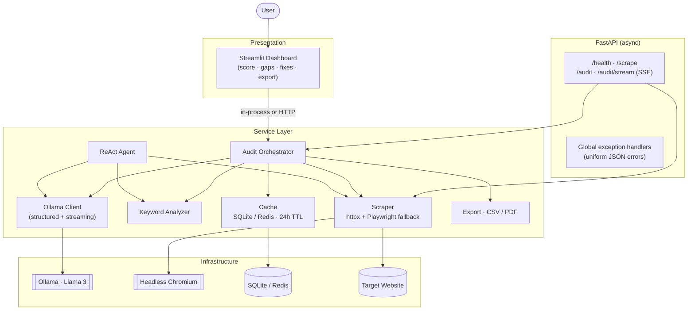
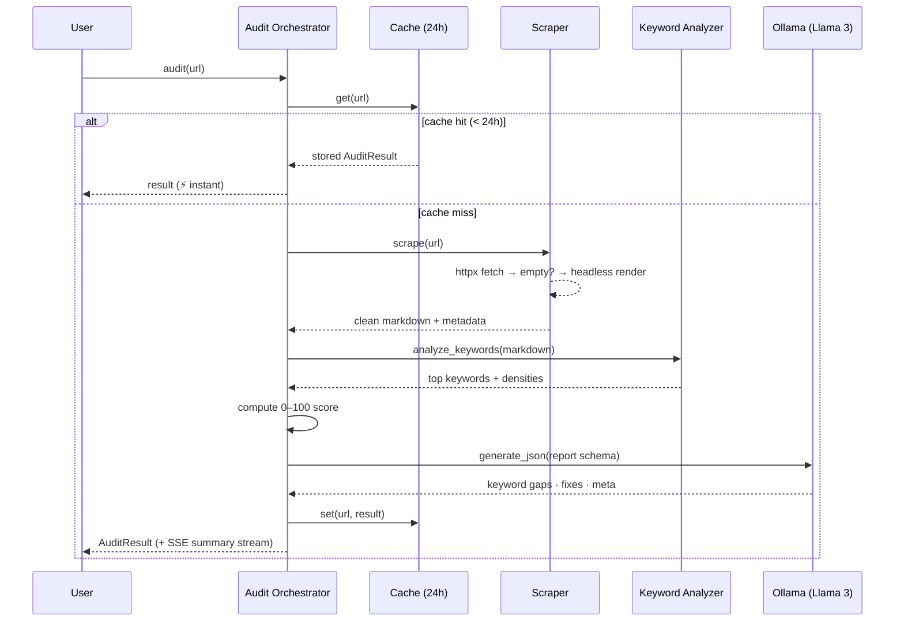

# 🚀 AI SEO Agent

> An autonomous, local-first SEO auditing agent. Point it at any URL — including
> JavaScript-rendered SPAs — and it scrapes the page, analyzes keywords, and uses
> a locally-running **Llama 3** model to produce a structured, actionable SEO
> report: an overall score, keyword gaps, technical fixes, and a rewritten meta
> description — delivered through a polished dashboard and a typed API.

<p>
  
  
  
  
  
  
</p>

---

## Table of Contents

- [Why this exists (Business Value)](#-business-value)
- [Features](#-features)
- [Architecture](#-architecture)
- [Tech Stack](#-tech-stack)
- [Quickstart (Docker Compose)](#-quickstart-docker-compose)
- [Local Development](#-local-development)
- [API Reference](#-api-reference)
- [Configuration](#-configuration)
- [Project Structure](#-project-structure)
- [Testing & Quality](#-testing--quality)
- [Roadmap](#-roadmap)

---

## 💼 Business Value

On-page SEO audits are repetitive, manual, and expensive. A junior analyst at an
agency spends **30–60 minutes per page** pulling the title and meta description,
eyeballing keyword usage, listing technical issues, and hand-writing
improvements. Across a client portfolio that's dozens of hours a week of
low-leverage work.

This agent compresses that loop into **~30 seconds, autonomously**:

| Manual workflow | With the AI SEO Agent |
|---|---|
| Open the page, copy the content by hand | Scrapes & cleans the page (incl. JS-rendered SPAs) automatically |
| Mentally tally keyword usage | Quantified keyword density + gap analysis |
| Subjectively guess a "score" | Deterministic, explainable **0–100 score** with a per-signal breakdown |
| Write recommendations from scratch | LLM-generated keyword gaps, prioritized technical fixes, and a ready-to-paste meta description |
| Paste findings into a doc | One-click **CSV / PDF** client deliverable |

**Why local-first?** It runs entirely on your machine via [Ollama](https://ollama.com)
— **zero per-call API cost**, no client data leaving your network, and no
rate-limit ceilings. An agency can audit an unlimited number of pages for the
price of the hardware it already owns.

**Net effect:** turn an hour of analyst time into a 30-second, repeatable,
exportable deliverable — and cache it so re-checks are instant.

---

## ✨ Features

- **Autonomous ReAct agent** — a reason-act-observe loop that decides which tools
  to call (`scrape_url`, `analyze_keywords`) and stops only when it has produced
  a complete, schema-validated report.
- **Resilient scraping** — async `httpx` with browser-like headers, exponential
  backoff on rate limits, and an automatic **headless-Chromium fallback** for
  JavaScript-rendered pages.
- **Structured LLM output** — Ollama's schema-constrained decoding + Pydantic
  validation guarantee well-formed JSON every time.
- **Explainable SEO score** — 0–100 from concrete signals (title, meta, content
  depth, keyword focus), each shown as a sub-score.
- **24-hour caching** — SQLite (zero-config) or Redis; repeat audits return
  **instantly** (measured ~8,000× speedup on a cache hit).
- **Streaming UX** — Server-Sent Events stream the executive summary token-by-token
  for a ChatGPT-style typing effect.
- **One-click exports** — download any report as CSV or PDF.
- **Graceful degradation** — CAPTCHA/bot-blocks, timeouts, and oversized pages
  all return structured, user-friendly JSON errors — never a stack trace.
- **Production hygiene** — full type hints, Pydantic I/O models, a `pytest`
  suite, `black`/`flake8`, Dockerized services, and CI.

---

## 🏗 Architecture



### Audit request flow



---

## 🧰 Tech Stack

| Layer | Technology | Why |
|---|---|---|
| **API** | FastAPI + Uvicorn | Async, type-driven, auto OpenAPI docs |
| **Frontend** | Streamlit | Fast, data-centric UI with native streaming |
| **LLM** | Ollama · Llama 3 (`llama3.2:3b`) | Local, free, private structured generation |
| **Scraping** | httpx (async) · BeautifulSoup · markdownify | Non-blocking fetch → clean Markdown |
| **JS rendering** | Playwright (headless Chromium) | Handles client-rendered SPAs |
| **Validation** | Pydantic v2 + pydantic-settings | Strict typed I/O & config |
| **Caching** | SQLite / Redis | 24h result cache, graceful degradation |
| **Resilience** | tenacity | Exponential backoff retries |
| **Export** | fpdf2 · csv | CSV / PDF client deliverables |
| **Tooling** | pytest · black · flake8 · Docker · GitHub Actions | Tested, formatted, linted, containerized, CI |

---

## ⚡ Quickstart (Docker Compose)

The fastest path to a full stack (API + UI + Ollama + Redis):

```bash
# 1. Build and start everything
docker compose up --build

# 2. Pull the model into the Ollama container (one-time)
docker compose exec ollama ollama pull llama3.2:3b
```

Then open:

- **Dashboard** → http://localhost:8501
- **API docs** → http://localhost:8000/docs

> 💡 The bundled Ollama runs on **CPU**. If you have a GPU and run Ollama natively
> on the host, drop the `ollama` service and set
> `SEO_OLLAMA_BASE_URL=http://host.docker.internal:11434` on the `api`/`ui`
> services for much faster inference.

---

## 🛠 Local Development

```bash
# 1. Create a virtual environment
python -m venv .venv
# Windows PowerShell:
.venv\Scripts\Activate.ps1
# macOS/Linux:
# source .venv/bin/activate

# 2. Install dependencies
pip install -r requirements.txt          # runtime
pip install -r requirements-dev.txt       # + test/lint tooling
python -m playwright install chromium     # headless browser for SPA rendering

# 3. Start a local LLM (separate terminal)
ollama serve
ollama pull llama3.2:3b

# 4a. Run the API
uvicorn app.main:app --reload             # http://127.0.0.1:8000/docs

# 4b. Run the dashboard
streamlit run app/ui/streamlit_app.py     # http://localhost:8501
```

> The dashboard ships with a **Demo mode** (sample data, no backend) so you can
> explore the UI instantly. Toggle it off on the **Run Audit** page for a live
> audit against a real URL + your local model.

---

## 📡 API Reference

Base path: `/api/v1`

| Method | Endpoint | Description |
|---|---|---|
| `GET`  | `/health` | Liveness probe (service + version) |
| `POST` | `/scrape` | Fetch a URL → clean Markdown + metadata |
| `POST` | `/audit` | Full SEO audit → structured `AuditResult` (cached) |
| `POST` | `/audit/stream` | Same, but streams the executive summary via SSE |
| `POST` | `/projects` · `GET` `/projects` | Create / list projects (multi-tenant, persisted) |
| `POST` | `/projects/{id}/audit` | Run an audit for a project and **persist** it |
| `GET` | `/projects/{id}/audits` · `/recommendations` | Read persisted audit history & prioritized recommendations |

**Run an audit:**

```bash
curl -X POST http://localhost:8000/api/v1/audit \
  -H "Content-Type: application/json" \
  -d '{"url": "https://www.example.com", "render_js": true, "use_cache": true}'
```

```jsonc
{
  "url": "https://www.example.com",
  "fetched_url": "https://www.example.com/",
  "overall_score": 75,
  "grade": "C",
  "breakdown": { "title": 88, "meta_description": 40, "content_depth": 85, "keyword_focus": 95 },
  "keyword_gaps": [
    { "keyword": "vegan birthday cake delivery", "rationale": "High commercial intent; absent from the page." }
  ],
  "technical_fixes": [
    { "issue": "Meta description too short", "recommendation": "Expand to 150–160 chars with primary keywords.", "severity": "high" }
  ],
  "rewritten_meta_description": "Order artisan vegan cakes & gluten-free treats, delivered daily...",
  "from_cache": false
}
```

**Stream the summary (SSE):**

```bash
curl -N -X POST http://localhost:8000/api/v1/audit/stream \
  -H "Content-Type: application/json" \
  -d '{"url": "https://www.example.com"}'
# event: result  → full AuditResult JSON
# event: token   → summary text chunks (repeated)
# event: done
```

### Error format

Every failure returns the same envelope (never a stack trace):

```json
{ "error_code": "crawler_blocked", "message": "Target website blocked the crawler.", "detail": "HTTP 403" }
```

| HTTP | `error_code` | When |
|---|---|---|
| 400 | `invalid_url` | Malformed / unsupported URL |
| 403 | `crawler_blocked` | 403, CAPTCHA, or bot-challenge page |
| 413 | `content_too_large` | Body exceeds the size cap |
| 422 | `empty_content` / `validation_error` | Nothing extractable / bad request |
| 429 | `rate_limited` | Upstream `429`/`503` after all retries |
| 502 | `fetch_failed` / `upstream_http_error` / `llm_bad_response` | Upstream/LLM failure |
| 503 | `llm_unavailable` | Ollama not reachable |
| 504 | `llm_timeout` | Model generation timed out |
| 500 | `internal_error` | Unexpected server error |

---

## ⚙️ Configuration

All settings are environment variables prefixed with `SEO_` (see
[.env.example](.env.example)). Highlights:

| Variable | Default | Purpose |
|---|---|---|
| `SEO_OLLAMA_BASE_URL` | `http://localhost:11434` | Ollama server URL |
| `SEO_OLLAMA_MODEL` | `llama3.2:3b` | Model used for generation |
| `SEO_OLLAMA_TIMEOUT` | `120` | LLM request timeout (s) |
| `SEO_REQUEST_TIMEOUT` | `15` | Per-fetch connect+read timeout (s) |
| `SEO_MAX_RETRIES` | `4` | Fetch attempts before giving up |
| `SEO_CACHE_BACKEND` | `sqlite` | `sqlite`, `redis`, or `none` |
| `SEO_CACHE_TTL_SECONDS` | `86400` | Cache lifetime (24h) |
| `SEO_REDIS_URL` | `redis://localhost:6379/0` | Used when backend is `redis` |
| `SEO_AGENT_MAX_STEPS` | `8` | ReAct loop iteration cap |

---

## 📂 Project Structure

```
app/
├── main.py                  # FastAPI app + global exception handlers
├── config.py                # env-driven settings (pydantic-settings)
├── api/routes.py            # /health, /scrape, /audit, /audit/stream
├── schemas/                 # Pydantic request/response models
│   ├── scrape.py            #   scrape + health
│   ├── audit.py             #   audit request
│   └── agent.py             #   AgentStep + FinalReport
├── services/
│   ├── scraper.py           # async fetch → extract → markdown (+ JS fallback)
│   ├── renderer.py          # headless Chromium (Playwright)
│   ├── keyword_analyzer.py  # density / gap analysis
│   ├── ollama.py            # async LLM client (structured + streaming)
│   ├── audit.py             # orchestration + scoring + cache
│   ├── cache.py             # SQLite / Redis cache (24h TTL)
│   └── export.py            # CSV / PDF deliverables
├── agent/
│   ├── orchestrator.py      # ReAct loop
│   └── tools.py             # scrape_url, analyze_keywords tools
├── core/
│   ├── exceptions.py        # typed errors → HTTP statuses
│   └── logging.py
└── ui/
    ├── streamlit_app.py     # dashboard (streaming + export)
    └── theme.py             # premium CSS + components

tests/                       # pytest suite (scraper, agent, ollama, cache, export, api)
Dockerfile · docker-compose.yml · .github/workflows/ci.yml
```

---

## ✅ Testing & Quality

```bash
black --check app tests      # formatting
flake8 app tests             # linting
pytest                       # full test suite (fully mocked — no network/LLM/browser)
```

The CI pipeline ([.github/workflows/ci.yml](.github/workflows/ci.yml)) runs all
three on every push / PR to `main`. Tests are hermetic: HTTP is mocked with
`httpx.MockTransport`, the LLM is scripted, and no headless browser or Ollama
instance is required.

---

## 🗺 Roadmap

- Multi-page / sitemap crawling with site-wide scoring
- Competitor comparison (audit N URLs, diff the gaps)
- Real search-volume data via an external keyword API
- Historical tracking — store audits and chart score-over-time
- Auth + multi-tenant cache namespacing for agency use

---

## 📄 License

MIT — see [LICENSE](LICENSE).
